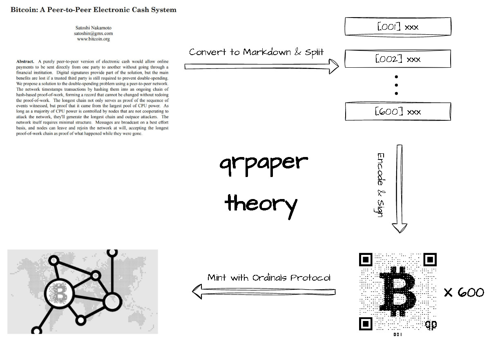
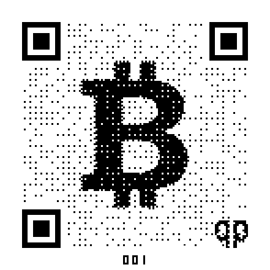

# qrpaper 

## Slogan
Salute to Satoshi, every blockchain project should inscribe their white paper on Bitcoin.

## Significance
As the earliest blockchain, Bitcoin's value mainly comes from consensus, 
but it is also constantly facing challenges from other public chains. 
In order to consolidate the value of Bitcoin, we put forward the slogan 
"Salute to Satoshi, every blockchain project should inscribe their white paper on Bitcoin", 
which is not only conducive to continuously strengthening the consensus of Bitcoin, 
but also It is beneficial for new projects to be understood and accepted by Bitcoin users.

## Introduction
qrpaper converts the white paper into a plain text markdown format, 
and after splitting it into sentences, encodes each sentence into a QR code, 
signs it and inscribe it on Bitcoin with Ordinals Protocol for permanent storage.

## Why bitcoin
1. Bitcoin is the first blockchain, it is the chain with the highest degree of consensus and the highest security
2. Bitcoin ordinals protocol, storing all of the NFT data on the chain, it would not be lost forever
3. Bitcoin has the largest TVL, inscribing your project white paper on Bitcoin is very memorable and advantageous 

## Why qrpaper
1. qrpaper is the first project who helps users inscribe their white paper on Bitcoin use ordinals protocol
2. qrpaper optimized the NFT image generation technology, compressed the data size to the limit, it greatly reduced the gas
3. qrpaper use qrpaper.sats domain to sign every NFT to ensure no one can fake it
4. qrpaper split and visualized the white paper to qrcode, which has a beautiful style, it is easy to spread
5. qrpaper is governed by community through qp-dao, it's a decentralized project

## How to inscribe
[inscribe tutorial](docs/inscribe.md)

## How to verify 
[verify tutorial](docs/verify.md)

## Pay attention
1. every qrpaper is signed by **qrpaper.sats**, and **qp** logo is embeded
2. the address of it is: **12duB7eUwCCqum5rezYJGRy2UDhb4EkeoN**
3. the taproot address is: **bc1p3lpgz3246uqc87zp8ex7s7q6xka0z9g0djv9n0e2a3gqqlcetl4stwgrqd**

## qp-dao
Next, we will start the qp-dao, everyone who holds the NFT of the three core qrpaper(bitcoin, ethereum and qrpaper) 
will have the right to join. And you will have the benifits like airdrop, whitelist, vote and so on.

## core-qrpaper
* [qrpaper-bitcoin](qrpaper-bitcoin/README.md)
* [qrpaper-ethereum](qrpaper-ethereum/README.md)
* [qrpaper-qrpaper](qrpaper-qrpaper/README.md)

## Cooperate
As project, please contact us through email, we can help you with:
1. generate qrpaper NFT image of your white paper freely
2. promote your project on our social media and community freely

## Contact us
1. issues: <https://github.com/qrpaper/qrpaper/issues>
2. email: <coffeeking001@outlook.com>
3. discord: <https://discord.gg/3MjNRBhuRv>
4. twitter: <https://twitter.com/qrpaper_sats>

## Example
This is an example qrpaper, which include the first fragment of the Bitcoin White Paper. 
The size of it is only about 1~2KB, it's very cheap to inscribe on Bitcoin chain.

The image contains four part mainly:
1. the qrcode imformation in the whole image
2. the bitcoin logo in the middle
3. the qrpaper logo in the bottom right corner
4. the serial number in the foot

