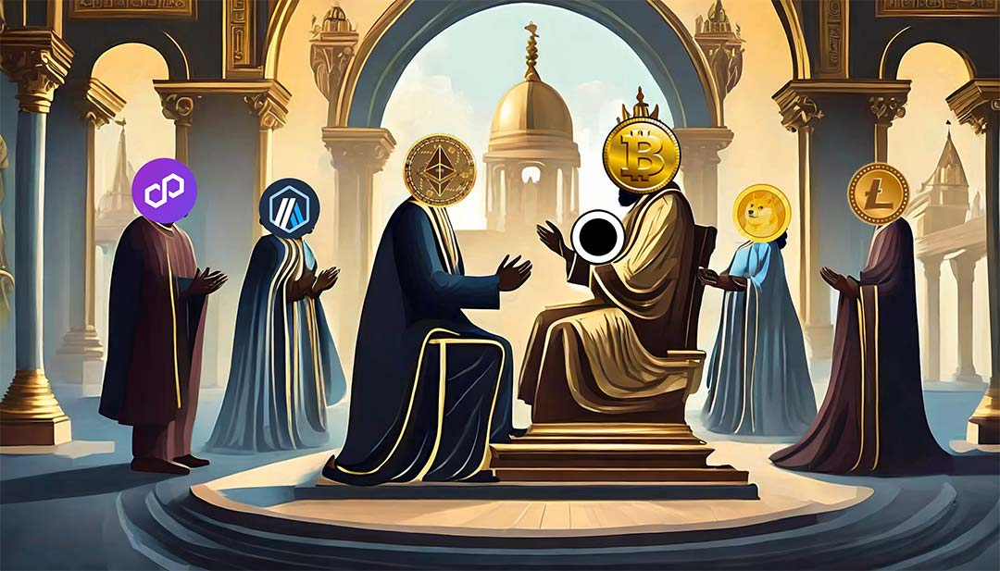
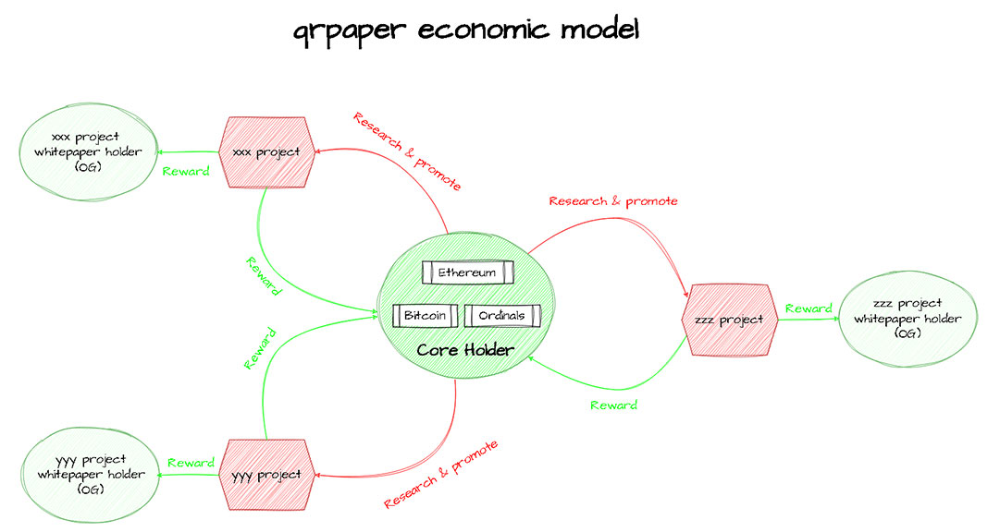

# qrpaper 

## Slogan
Salute to Satoshi, every project should inscribe WhitePaper on Bitcoin.

## Features
1. This is a Bitcoin-native NFT, distinct from other PFP projects are copy from Ethereum.
2. It's core mission is to strengthen the consensus of the Bitcoin, serving a practical purpose.
3. It has a robust economic model, capable of long-term and sustainable growth.

## Introduction
qrpaper is a project who help crypto project publish whitepaper on Bitcoin with 
**WhitePaper Sharding Technology**. It converts the whitepaper into 
plain text format of markdown, and after splitting it into sentences, 
encodes each sentence into a QR code, signs it and inscribe it on Bitcoin 
with Ordinals Protocol for permanent storage.

## Significance
As the earliest blockchain, Bitcoin's value mainly comes from consensus, 
but it is also constantly facing challenges from other public chains. 
In order to consolidate the value of Bitcoin, we put forward the slogan 
"Salute to Satoshi, every project should inscribe WhitePaper on Bitcoin", 
which is not only conducive to continuously strengthening the consensus of Bitcoin, 
but also It is beneficial for new projects to be understood and accepted by Bitcoin users.

## qp-dao
Everyone who holds the NFT of the three core qrpaper(bitcoin, ethereum and ordinals) 
will have the right to join. And you will have the benifits like airdrop, whitelist, 
vote, reward and vip-role to read our crypto project research report.

## RoadMap
1. Publish the three core qrpaper(bitcoin, ethereum and ordinals) 
2. Build qp-dao and the core team to do crypto project research
3. Help other crypto project to publish whitepaper on bitcoin 
4. waiting for more suggestions from community...

## Economic
The core team consists of holders of Bitcoin, Ethereum, and Ordinals WhitePaper NFT, 
who conduct research on early-stage crypto projects, assist in the publish of 
WhitePaper NFTs, and provide support for promote.

In return, these projects are expected to reward the core team with a portion of 
airdrops, whitelist, project tokens, etc.

Non-core members holding NFTs from other projects will receive OG-role (Original Gangster)
in those projects and will receive ongoing reward from the respective projects.

## Why bitcoin
1. Bitcoin is the first blockchain, it is the chain with the highest degree of consensus and the highest security
2. Bitcoin ordinals protocol, storing all of the NFT data on the chain, it would not be lost forever
3. Bitcoin has the largest TVL, inscribing your project whitepaper on Bitcoin is very memorable and advantageous 

## Why qrpaper
1. qrpaper is the first project who helps users inscribe their whitepaper on Bitcoin use ordinals protocol
2. qrpaper optimized the NFT image generation technology, compressed the data size to the limit, it greatly reduced the gas
3. qrpaper use qrpaper.sats domain to sign every NFT to ensure no one can fake it
4. qrpaper split and visualized the whitepaper to qrcode, which has a beautiful style, it is easy to spread
5. qrpaper is governed by community through qp-dao, it's a decentralized project

## How to inscribe
[inscribe tutorial](docs/inscribe.md)

## How to verify 
[verify tutorial](docs/verify.md)

## Pay attention
1. every qrpaper is signed by **qrpaper.sats**, and **qp** logo is embeded
2. the address of it is: **12duB7eUwCCqum5rezYJGRy2UDhb4EkeoN**
3. the taproot address is: **bc1p3lpgz3246uqc87zp8ex7s7q6xka0z9g0djv9n0e2a3gqqlcetl4stwgrqd**

## core-qrpaper
* [qrpaper-bitcoin](./qrpaper-bitcoin/)
* [qrpaper-ethereum](./qrpaper-ethereum/)
* [qrpaper-ordinals](./qrpaper-ordinals/)

## Cooperate
As project, please contact us through email, we can help you with:
1. generate qrpaper NFT image of your whitepaper freely
2. promote your project on our social media and community freely

## Contact us
1. issues: <https://github.com/qrpaper/qrpaper/issues>
2. email: <coffeeking001@outlook.com>
3. telegram: <https://t.me/qrpaper>
4. discord: <https://discord.gg/3MjNRBhuRv>
5. twitter: <https://twitter.com/qrpaper_sats>

## Example
This is an example qrpaper, which include the first fragment of the Bitcoin White Paper. 
The size of it is only about 1KB, it's very cheap to inscribe on Bitcoin chain.

The image contains four part mainly:
1. the qrcode imformation in the whole image
2. the bitcoin logo in the middle
3. the qrpaper logo in the bottom right corner
4. the serial number in the foot

