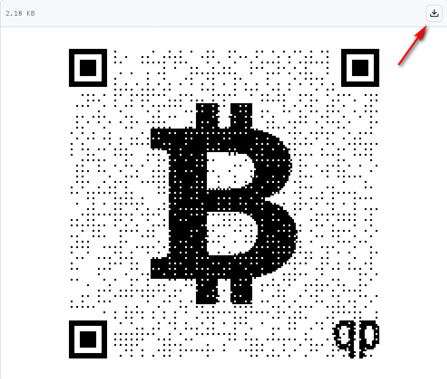

# qrpaper 

## install bitcoin wallet
1. unisat <https://unisat.io>
2. xverse <https://www.xverse.app>
3. sparrow <https://sparrowwallet.com>
4. or others (should support ordinals)

## Download NFT image
1. go to **"qrpaper-xxx/nfts"** or **"qrpaper-xxx/img"** directory
2. choose one image, click on it
3. download it from the top-right button

## Check inscribable
1. go to: <https://ordinalsbot.com>
2. switch to **"Hash Check"** tab
3. upload and check whether it has been inscribed

## Inscribe with ordinalsbot
1. go to: <https://ordinalsbot.com>
2. switch to **"Files"** tab, the **"Optimize images"** must be unchecked
3. upload and inscribe to your wallet address (must start with bc1p)

## Or Inscribe with unisat
1. go to: <https://unisat.io/inscribe>
2. switch to **"Files"** tab
3. upload and inscribe to your wallet address (must start with bc1p)

## Get help
join in discord: <https://discord.gg/3MjNRBhuRv>
