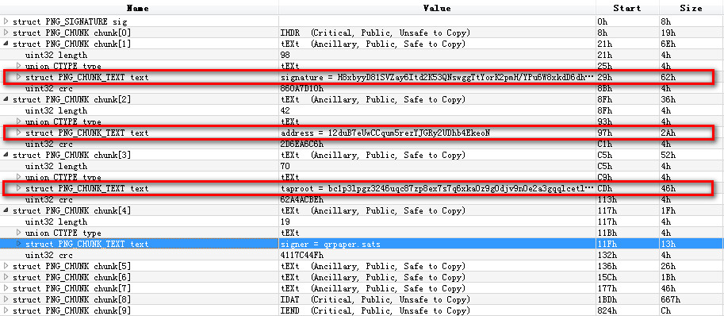

# qrpaper 

## Verify

require python3.7 and `pip install pycoin`

all qrpaper images are signed by qrpaper.sats domain with address 12duB7eUwCCqum5rezYJGRy2UDhb4EkeoN

you can use verify.py to verify a NFT is not fake image:

```
>python verify.py filename.png
True
```


## Metadata

you can use 010Editor to check the metadata of the NFT image




## SHA256 

whitepaper with extra image is using sha256 of the image instead.

you can use this sha256 value to find where the extra image is on the chain.

the sha256 can be get by using sha256.py:

```
>python sha256.py filename.png
d5adeaae32e20792fea98dc3da34a03f75d98ee617c0d82d31915370f2267e09
```


## Get help
join in discord: <https://discord.gg/3MjNRBhuRv>
